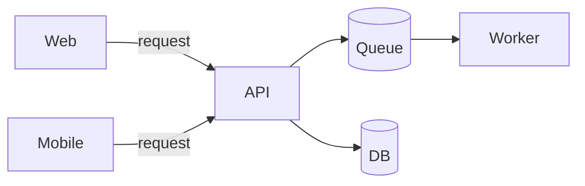
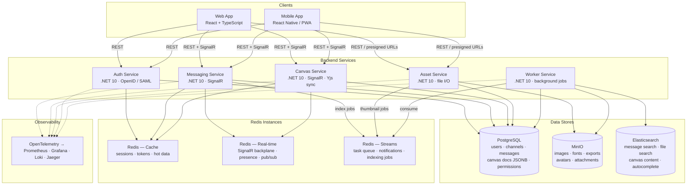
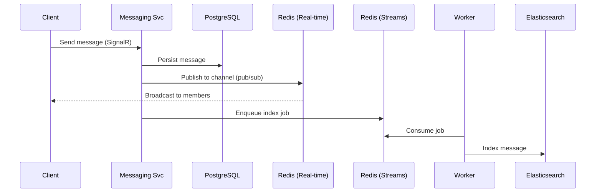
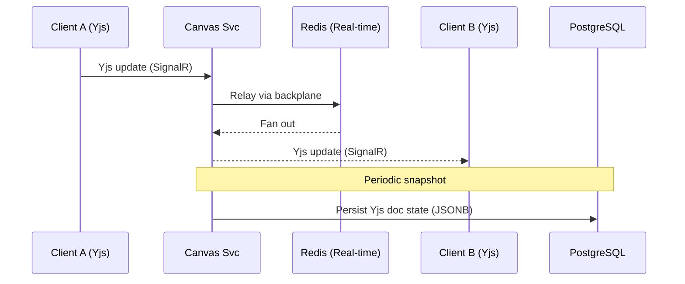
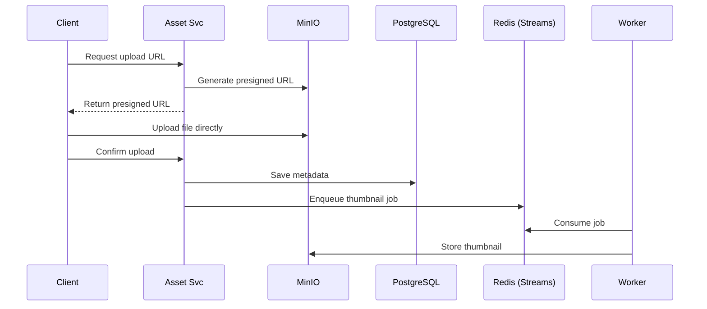

# CollabHub — System Architecture

> Infrastructure-agnostic · Kubernetes-native · .NET 10

---

## Overview

CollabHub is an internal real-time collaboration platform that combines the messaging capabilities of Slack with the collaborative design canvas of Figma into a single unified application. The system enables teams to communicate through channels and threads while simultaneously co-editing visual design documents in real time, with live cursors, presence indicators, and conflict-free concurrent editing powered by CRDTs.

The platform is built as a set of independently deployable .NET 10 microservices, each owning a distinct domain: authentication and identity, messaging, collaborative canvas editing, and asset management. A shared SignalR-based real-time layer provides persistent WebSocket connections across the messaging and canvas services, enabling sub-second updates for chat messages, cursor movements, and design operations. Background processing — search indexing, thumbnail generation, notifications — is handled asynchronously via Redis Streams and a dedicated worker service.

The frontend is a React + TypeScript single-page application (with a React Native or PWA path for mobile) that communicates with backend services over REST for standard operations and SignalR for all real-time interactions. Collaborative editing on the canvas uses the Yjs CRDT library on the client side, with the backend acting as a relay and persistence layer rather than processing merge logic directly.

The architecture is designed to be infrastructure-agnostic from day one. All services are containerised and orchestrated via Kubernetes, with no dependencies on any specific cloud provider. The initial deployment target is on-premises Kubernetes, with a planned migration path to Azure using managed equivalents for each infrastructure component — achievable through configuration changes rather than code changes.

---

## Original Whiteboard Sketch

The initial architecture concept, as sketched during our first whiteboard session:

This captured the core request/response flow — clients talking to a central API, with a queue and worker for async processing, and a database for persistence. The full architecture below builds on this foundation, adding the real-time layer, separated service domains, asset storage, search, and observability needed for a collaborative platform.

---

## System Diagram

---

## Service Breakdown

### Auth Service
Handles identity via OpenID Connect for internal SSO and optionally SAML for enterprise federation. Issues JWTs consumed by all other services. User profiles and permissions stored in PostgreSQL, session tokens cached in Redis for fast validation.

### Messaging Service
Owns channels, threads, messages, reactions, and read receipts. Exposes REST endpoints for CRUD and a SignalR hub for real-time delivery. Messages persisted to PostgreSQL, then asynchronously indexed into Elasticsearch via Redis Streams.

### Canvas Service
The collaborative design half. Manages documents, layers, and components. Yjs CRDT state syncs between clients via SignalR — the backend relays updates and periodically snapshots document state to PostgreSQL as JSONB. CRDT merge logic lives entirely in the Yjs client library.

### Asset Service
Handles file uploads via presigned MinIO URLs to avoid proxying large blobs. Publishes processing tasks (thumbnails, image optimisation) to Redis Streams for the worker.

### Worker Service
Headless .NET 10 background service consuming jobs from Redis Streams. Handles image thumbnailing (ImageSharp), Elasticsearch index updates, notification dispatch, export jobs, and data retention cleanup. Scales horizontally via KEDA based on queue depth.

---

## Data Flow Examples

### Sending a Chat Message

### Collaborative Canvas Edit

### File Upload

---

## Tech Stack Summary

| Layer | Technology | Rationale |
|---|---|---|
| Frontend | React + TypeScript | Rich ecosystem for canvas + chat UIs |
| Real-time CRDT | Yjs | Best-in-class CRDT library, strong community |
| Backend Services | .NET 10 (ASP.NET Core) | Team expertise, performance, SignalR built-in |
| Real-time Transport | SignalR | Native .NET, WebSocket with fallbacks |
| Primary Database | PostgreSQL | JSONB for canvas docs, strong .NET support, free |
| Cache / RT / Queue | Redis (3× independent) | Isolated failure domains, simple ops |
| Object Storage | MinIO | S3-compatible, runs anywhere |
| Search | Elasticsearch | Full-text across messages, files, canvas content |
| Observability | OTel + Prometheus + Grafana + Loki + Jaeger | K8s-native, open-source |
| Orchestration | Kubernetes | Portable across on-prem and cloud |

---

## Infrastructure

### Approach

The system is designed around a two-phase deployment strategy. Phase one is on-premises Kubernetes — all infrastructure components (PostgreSQL, Redis, MinIO, Elasticsearch) run as workloads within the cluster, managed via Helm charts or operators. This gives the team full control during initial development and early adoption, with no cloud spend or external dependencies.

Phase two is a migration to Azure, replacing self-hosted infrastructure with managed equivalents: Azure Database for PostgreSQL, Azure Cache for Redis, Azure Blob Storage, and Elastic Cloud or Azure AI Search. Because every service reads its configuration from environment variables and Kubernetes ConfigMaps/Secrets, this migration is a configuration change — connection strings, endpoints, and credentials — rather than a code change. The application layer remains untouched.

All container images are built once and run identically in both environments. No cloud-specific SDKs are used in the application code where an infrastructure-agnostic alternative exists (e.g. S3-compatible API for object storage rather than the Azure Blob SDK directly).

### Infrastructure Portability

| Concern | On-Prem (K8s) | Azure (future) |
|---|---|---|
| Object Storage | MinIO | Azure Blob (S3-compat or SDK swap) |
| Database | PostgreSQL on K8s | Azure Database for PostgreSQL |
| Redis | 3× standalone on K8s | 3× Azure Cache for Redis |
| Search | Self-hosted Elasticsearch | Elastic Cloud or Azure AI Search |
| Secrets | Sealed Secrets / Vault | Azure Key Vault + CSI driver |
| CI/CD | GitLab CI / GitHub Actions | Same, or Azure DevOps |

### Redis Instance Strategy

Three independent Redis instances, each with a single concern:

| Instance | Purpose | Failure Impact |
|---|---|---|
| Cache | Sessions, tokens, hot data | Users may need to re-auth; slightly slower reads |
| Real-time | SignalR backplane, presence, pub/sub | Real-time updates pause; clients reconnect automatically |
| Streams | Task queue for async work | Background jobs queue on restart; no user-facing impact |

This avoids a single Redis failure taking down everything, and lets you size and tune each instance independently. No Sentinel or Cluster overhead to start — just three standalone instances with periodic RDB snapshots for durability.
