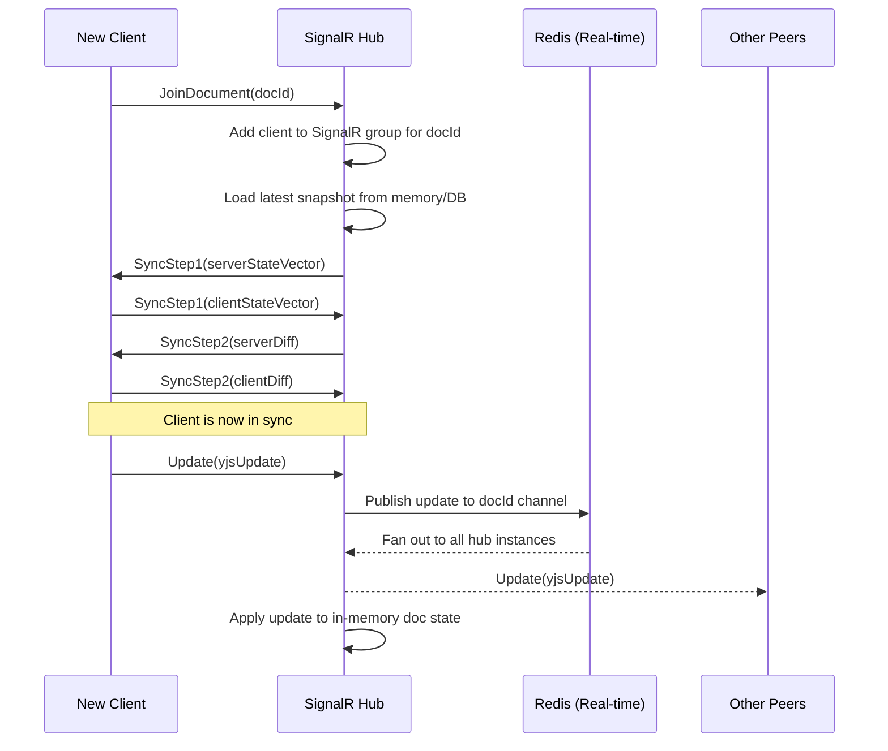

# CEP-0001: Real-Time Collaborative Canvas with Yjs and SignalR

<!-- CollabHub Enhancement Proposal, following Kubernetes KEP format -->

## Release Signoff Checklist

Items marked with (R) are required *prior to targeting to a milestone*.

- [ ] (R) CEP approvers have approved the CEP status as `implementable`
- [ ] (R) Design details are appropriately documented
- [ ] (R) Test plan is in place
- [ ] (R) Graduation criteria is in place
- [ ] (R) Production readiness review completed
- [ ] "Implementation History" section is up-to-date for milestone
- [ ] Supporting documentation — additional design documents, links to discussions, relevant PRs/issues

## Table of Contents

- [Summary](#summary)
- [Motivation](#motivation)
  - [Goals](#goals)
  - [Non-Goals](#non-goals)
- [Proposal](#proposal)
  - [User Stories](#user-stories)
  - [Notes/Constraints/Caveats](#notesconstraintscaveats)
  - [Risks and Mitigations](#risks-and-mitigations)
- [Design Details](#design-details)
  - [Yjs Document Model](#yjs-document-model)
  - [SignalR Sync Protocol](#signalr-sync-protocol)
  - [Server-Side State Management](#server-side-state-management)
  - [Persistence Strategy](#persistence-strategy)
  - [Reconnection and Recovery](#reconnection-and-recovery)
  - [Awareness Protocol (Cursors and Presence)](#awareness-protocol-cursors-and-presence)
  - [Document Size and Scaling](#document-size-and-scaling)
  - [Test Plan](#test-plan)
  - [Graduation Criteria](#graduation-criteria)all 
- [Production Readiness Review](#production-readiness-review)
  - [Feature Enablement and Rollback](#feature-enablement-and-rollback)
  - [Rollout Planning](#rollout-planning)
  - [Monitoring Requirements](#monitoring-requirements)
  - [Dependencies](#dependencies)
  - [Scalability](#scalability)
  - [Troubleshooting](#troubleshooting)
- [Implementation History](#implementation-history)
- [Drawbacks](#drawbacks)
- [Alternatives](#alternatives)

---

## Summary

This CEP proposes the design for CollabHub's real-time collaborative canvas — the "Figma half" of the platform. Multiple users must be able to simultaneously edit a shared design document with sub-second latency, visible cursors, and zero data loss from concurrent edits. The proposal covers how the Yjs CRDT library on the client integrates with the .NET 10 Canvas Service via SignalR, how document state is persisted to PostgreSQL, and how clients recover after disconnection. This is the highest-risk, most architecturally novel component in the system and the one where our team has the least prior experience.

## Motivation

CollabHub's value proposition depends on real-time collaborative editing working reliably. If two designers edit the same canvas and one person's changes are silently lost, trust in the platform is destroyed. Unlike messaging — where eventual delivery in order is sufficient — canvas collaboration requires conflict-free merging of concurrent operations at sub-second latency with no coordination locks.

This is a fundamentally different problem from anything our team has built before. Our .NET services handle request/response and pub/sub patterns well, but a persistent, stateful, bidirectional sync protocol between multiple clients and a server is a new class of challenge. The decisions made here will be extremely difficult to reverse once clients are storing documents in this format, making it critical to get the foundational design right.

### Goals

- Define the Yjs document schema used to represent canvas documents (layers, shapes, text, groups, connections)
- Specify the SignalR hub protocol for syncing Yjs updates between clients
- Establish the persistence strategy: what is saved, how often, and in what format
- Define the client reconnection and state recovery flow
- Specify the awareness protocol for cursors, selections, and presence
- Set document size limits and define behaviour when limits are approached
- Provide a clear data loss window guarantee (maximum edits that can be lost in a crash)
- Establish metrics and observability for the sync layer

### Non-Goals

- Designing the canvas rendering engine or UI component library (frontend team owns this)
- Defining the REST API for canvas CRUD operations (create, list, delete, rename, permissions) — these are standard and will be covered in the Canvas Service design doc
- Real-time collaboration on messaging (the Messaging Service handles its own SignalR flows independently)
- Offline editing and sync (deferred to a future CEP; see Alternatives)
- Version history UI or undo/redo across sessions (depends on the persistence model defined here but is a separate feature)

## Proposal

### User Stories

#### Story 1: Simultaneous Editing

As a designer, I open a canvas that my colleague is already editing. I can see their cursor and selection. When I add a shape to the canvas while they are editing text in another area, both changes appear on both screens within 200ms. Neither change is lost or requires manual conflict resolution.

#### Story 2: Reconnection After Network Drop

As a user on an unreliable network, my connection drops for 30 seconds. During that time, I continue making edits locally. When the connection is restored, my changes are automatically synced to the server and to other connected users without any manual intervention. Changes made by others during my disconnection also appear on my screen. No edits are lost from either side.

#### Story 3: Recovering a Previous Version

As a team lead, I open a canvas and discover that recent edits have taken the design in the wrong direction. I want to view the state of the canvas as it was yesterday morning. The system has periodic snapshots that allow me to browse and restore previous versions.

#### Story 4: Large Document Performance

As a designer working on a complex system diagram with 500+ elements, the canvas remains responsive. Operations (add, move, resize, delete) are reflected locally within 50ms and synced to peers within 300ms. The document loads in under 3 seconds when first opened.

### Notes/Constraints/Caveats

**Yjs is a JavaScript library.** The CRDT merge logic runs entirely on the client. The .NET Canvas Service does not interpret or process Yjs document content — it relays binary update messages between clients and persists opaque Yjs state snapshots. This is by design: it keeps the server simple, avoids reimplementing CRDT logic in C#, and means the server does not need to understand the document schema. The tradeoff is that the server cannot validate document content or enforce schema constraints.

**SignalR is the transport, not a Yjs provider.** Yjs has its own ecosystem of "providers" (y-websocket, y-webrtc, etc.) but none of them use SignalR. We will need to write a custom Yjs provider that wraps SignalR as the transport layer. This is a moderate engineering effort — the Yjs provider interface is well-documented, but it means we own the sync protocol implementation rather than using a battle-tested community provider.

**Binary protocol.** Yjs updates are binary (Uint8Array), not JSON. SignalR supports binary messages via MessagePack, so we will use the MessagePack protocol for the Canvas SignalR hub rather than the default JSON protocol. This affects client setup (must install @microsoft/signalr-protocol-msgpack) and means the hub's message payloads will not be human-readable in logs without decoding.

### Risks and Mitigations

| Risk | Impact | Likelihood | Mitigation |
|---|---|---|---|
| Custom SignalR provider has subtle sync bugs that cause data divergence between clients | Critical — silent data loss | Medium | Extensive property-based testing with simulated network conditions; canary deployment to a single team first |
| Yjs document grows unbounded, degrading performance over time | High — canvas becomes unusable | Medium | Implement garbage collection via `Y.encodeStateAsUpdate`; set size limits; alert on document size metrics |
| Server crash between snapshots loses recent edits | Medium — data loss within snapshot window | Low | Tune snapshot interval based on acceptable loss window; buffer recent updates in Redis Real-time instance |
| SignalR connection scaling limits (concurrent connections per pod) | Medium — capacity ceiling | Low | Load test early; horizontal scaling via Redis backplane is already in the architecture |
| Yjs library introduces a breaking change in a minor version | Medium — sync protocol breaks | Low | Pin exact version; integration test suite runs against pinned version; upgrade deliberately |
| MessagePack serialisation overhead or incompatibility | Low — performance or bugs | Low | Benchmark early in spike; fallback to Base64-encoded JSON if MessagePack proves problematic |

## Design Details

### Yjs Document Model

The canvas document is represented as a single `Y.Doc` containing the following shared types:

```
Y.Doc
├── Y.Map("meta")           # Document metadata: name, created, modified, owner
├── Y.Array("layers")       # Ordered list of layer IDs
├── Y.Map("layerProps")     # Layer ID → { name, visible, locked, opacity }
├── Y.Map("elements")       # Element ID → Y.Map of element properties
│   └── [elementId]: Y.Map
│       ├── type             # "rect" | "ellipse" | "text" | "path" | "group" | "image" | "connector"
│       ├── layerId          # Which layer this element belongs to
│       ├── x, y, w, h      # Position and dimensions
│       ├── rotation         # Degrees
│       ├── style            # Y.Map of style properties (fill, stroke, opacity, etc.)
│       └── ...              # Type-specific properties (text content, path data, etc.)
└── Y.Map("selections")     # Transient: user ID → Set of selected element IDs
```

**Rationale:** Using `Y.Map` for elements (keyed by ID) rather than `Y.Array` avoids the "interleaving" problem where concurrent inserts produce an unexpected ordering. Each element is independently addressable, so concurrent edits to different elements never conflict. Edits to the same element's properties merge at the property level — if user A changes `fill` while user B changes `x`, both changes are preserved.

**Text within elements:** For text elements, the `content` property is a `Y.Text` type, which gives character-level CRDT merging. This means two users can type in the same text box simultaneously without conflicts.

### SignalR Sync Protocol

The Canvas Service exposes a SignalR hub at `/hubs/canvas`. The hub uses the MessagePack protocol. All Yjs-related messages carry binary payloads.

#### Hub Methods (Server → Client)

| Method | Payload | Description |
|---|---|---|
| `SyncStep1` | `byte[]` | Server sends its state vector to a newly connected client |
| `SyncStep2` | `byte[]` | Server sends the document diff the client is missing |
| `Update` | `byte[]` | Broadcast: a Yjs update from another client |
| `AwarenessUpdate` | `byte[]` | Broadcast: cursor/selection/presence change from another client |

#### Hub Methods (Client → Server)

| Method | Payload | Description |
|---|---|---|
| `JoinDocument` | `string documentId` | Client requests to join a document room |
| `LeaveDocument` | `string documentId` | Client leaves a document room |
| `SyncStep1` | `byte[]` | Client sends its state vector during initial sync |
| `SyncStep2` | `byte[]` | Client sends the diff the server is missing |
| `Update` | `byte[]` | Client sends a Yjs update to be relayed to peers |
| `AwarenessUpdate` | `byte[]` | Client sends cursor/selection/presence state |

#### Sync Flow



### Server-Side State Management

The Canvas Service maintains an in-memory cache of active documents — documents with at least one connected client. This is necessary for two reasons: the server must participate in the Yjs sync protocol (it needs a state vector to sync with connecting clients), and it must persist state to the database.

**In-memory document lifecycle:**

1. **Load:** When the first client joins a document, the service loads the latest snapshot from PostgreSQL and initialises a server-side representation (not a full `Y.Doc` — just enough state to track the state vector and buffer updates).
2. **Active:** While clients are connected, incoming updates are applied to the in-memory state and relayed to peers via Redis pub/sub.
3. **Evict:** When the last client disconnects, a final snapshot is persisted. The in-memory state is retained for a grace period (configurable, default 5 minutes) to handle rapid reconnections, then evicted.

**Multi-instance coordination:** Because the Canvas Service runs as multiple pods behind the Redis SignalR backplane, a document could have clients connected to different pods. Each pod that has clients for a document maintains its own in-memory state. The Redis Real-time instance ensures all pods receive all updates, so the in-memory states converge. Snapshots are written by whichever pod's persistence timer fires — the snapshot is idempotent (a Yjs encoded state is deterministic for a given set of applied updates) so concurrent writes from multiple pods produce the same result.

**Memory limits:** Each pod monitors its total in-memory document size. If a pod exceeds its memory threshold (configurable, default 2GB), documents are evicted LRU. A Kubernetes HPA on memory usage ensures pods scale before hitting limits.

### Persistence Strategy

#### What is Persisted

| Data | Store | Format | Frequency |
|---|---|---|---|
| Full document snapshot | PostgreSQL (`canvas_snapshots` table) | Yjs `encodeStateAsUpdate` (binary, stored as `bytea`) | Every 30 seconds while document has active edits |
| Incremental updates | Redis Streams (Real-time instance) | Raw Yjs update bytes | Every update, retained for 1 hour |
| Document metadata | PostgreSQL (`canvas_documents` table) | Relational columns | On change |
| Version history snapshots | PostgreSQL (`canvas_versions` table) | Yjs `encodeStateAsUpdate` (binary) | Every 10 minutes, retained for 90 days |

#### Snapshot Interval and Data Loss Window

The **maximum data loss window is 30 seconds** of edits. This is the interval between periodic snapshots to PostgreSQL. In practice the window is smaller because:

- Incremental updates are buffered in Redis Streams with a 1-hour retention. If the Canvas Service crashes and restarts, it replays updates from Redis Streams on top of the last PostgreSQL snapshot.
- A clean shutdown (pod termination) triggers an immediate final snapshot before the process exits.

The 30-second interval is configurable. Reducing it decreases the data loss window but increases database write load. The recommendation is to start at 30 seconds and tune based on observed write volume.

#### Schema

```sql
CREATE TABLE canvas_documents (
    id              UUID PRIMARY KEY DEFAULT gen_random_uuid(),
    name            TEXT NOT NULL,
    owner_id        UUID NOT NULL REFERENCES users(id),
    channel_id      UUID REFERENCES channels(id),
    created_at      TIMESTAMPTZ NOT NULL DEFAULT now(),
    updated_at      TIMESTAMPTZ NOT NULL DEFAULT now(),
    element_count   INT NOT NULL DEFAULT 0,
    byte_size       BIGINT NOT NULL DEFAULT 0
);

CREATE TABLE canvas_snapshots (
    document_id     UUID PRIMARY KEY REFERENCES canvas_documents(id),
    state           BYTEA NOT NULL,
    state_vector    BYTEA NOT NULL,
    updated_at      TIMESTAMPTZ NOT NULL DEFAULT now()
);

CREATE TABLE canvas_versions (
    id              UUID PRIMARY KEY DEFAULT gen_random_uuid(),
    document_id     UUID NOT NULL REFERENCES canvas_documents(id),
    state           BYTEA NOT NULL,
    element_count   INT NOT NULL,
    byte_size       BIGINT NOT NULL,
    created_at      TIMESTAMPTZ NOT NULL DEFAULT now()
);

CREATE INDEX idx_canvas_versions_doc_time
    ON canvas_versions(document_id, created_at DESC);
```

### Reconnection and Recovery

Client disconnections are expected — mobile networks drop, laptops sleep, browsers are backgrounded. The reconnection flow must handle all of these transparently.

#### Short Disconnection (< 1 hour)

1. Client detects disconnection (SignalR `onclose` event).
2. Client continues accepting local edits, buffering Yjs updates in memory.
3. Client reconnects to SignalR hub (automatic retry with exponential backoff, built into SignalR client).
4. Client sends `JoinDocument` and executes the standard sync protocol (SyncStep1/SyncStep2).
5. Because the server has been receiving updates from other clients during the disconnection, the sync merges the client's buffered updates with the server's current state.
6. Both sides are now converged. No data is lost.

#### Long Disconnection (> 1 hour, or server restart)

1. Redis Streams retention has expired, so incremental updates are no longer available.
2. Client reconnects and syncs against the latest PostgreSQL snapshot.
3. If the client has buffered updates (browser tab was open but disconnected), those are merged during sync.
4. If the client has no buffered updates (browser was closed), it simply loads the latest server state.

#### Conflict Scenario

There is no manual conflict resolution in this system. Yjs CRDTs are designed such that all merge outcomes are deterministic given the same set of updates, regardless of the order they are received. The "last writer wins" semantic applies at the individual property level, not the document level — so if user A moves an element while user B changes its colour, both changes are preserved. Only if both users change the exact same property of the exact same element in the exact same moment does one win, and this is handled deterministically by Yjs's internal conflict resolution (based on client ID ordering).

### Awareness Protocol (Cursors and Presence)

Awareness is the Yjs term for ephemeral, per-user state — cursor position, selection, user name, user colour. It is not part of the document and is never persisted.

The awareness protocol uses a separate message type (`AwarenessUpdate`) sent over the same SignalR connection. Updates are broadcast to all peers in the document room via Redis pub/sub. Because awareness is ephemeral, there is no sync protocol for it — if a client reconnects, it simply starts broadcasting its state again and receives others' current awareness within one heartbeat interval.

**Heartbeat:** Each client sends an awareness update every 15 seconds even if nothing has changed. If a client's awareness has not been updated for 30 seconds, it is considered offline and removed from other clients' awareness state. This is handled by Yjs's built-in awareness timeout mechanism.

**Bandwidth:** Awareness updates are small (< 200 bytes each). With 20 concurrent editors at 15-second heartbeats, this adds approximately 1.3 KB/s of overhead per client. Cursor movement generates more frequent updates (on mouse move), but these are throttled on the client to 10 updates per second maximum.

### Document Size and Scaling

#### Limits

| Metric | Soft Limit | Hard Limit | Enforcement |
|---|---|---|---|
| Elements per document | 1,000 | 5,000 | Client-side warning at soft; server rejects updates that would exceed hard limit |
| Snapshot byte size | 5 MB | 20 MB | Client-side warning at soft; server rejects updates at hard limit |
| Concurrent editors per document | 20 | 50 | Server rejects `JoinDocument` at hard limit |
| Total active documents per pod | — | 500 | LRU eviction; HPA scales pods before this |

#### Garbage Collection

Yjs documents grow over time because they retain tombstones (markers for deleted content) to support the CRDT algorithm. Periodically, the server should perform garbage collection by encoding the current state as a fresh snapshot (`Y.encodeStateAsUpdate`) which discards tombstones. This is done:

- During the version history snapshot (every 10 minutes) — the snapshot is inherently a compacted state.
- When the document byte size exceeds the soft limit — an immediate compaction is triggered.

After compaction, the fresh snapshot replaces the current one in `canvas_snapshots`. Clients that reconnect after compaction will receive the compacted state, which is functionally identical but smaller.

### Test Plan

#### Unit Tests

- Yjs document model: verify schema structure, element CRUD, layer operations, concurrent edit merging
- Custom SignalR provider: encode/decode roundtrips for all message types, state vector generation, diff computation
- Persistence logic: snapshot encode/decode, version creation, cleanup of expired versions
- Reconnection logic: buffer management, sync after reconnect, state convergence

#### Integration Tests

- Two simulated clients editing the same document via a real SignalR hub and Redis backplane — verify convergence
- Client disconnection and reconnection with buffered edits — verify no data loss
- Server pod restart during active editing — verify recovery from PostgreSQL snapshot + Redis Streams replay
- Concurrent snapshot writes from multiple pods — verify idempotency
- Document at hard size limit — verify rejection of updates that would exceed limit

#### Chaos Tests

- Kill a Canvas Service pod during active editing and verify clients reconnect and converge
- Partition Redis Real-time instance and verify behaviour (updates should pause and resume, not corrupt)
- Simulate 50 concurrent editors on a single document at the element soft limit — measure latency and memory

#### Performance Benchmarks

- Measure sync latency (edit to peer visibility) under increasing concurrent editors (5, 10, 20, 50)
- Measure document load time at various sizes (100, 500, 1000, 5000 elements)
- Measure memory footprint per active document at various sizes
- Measure snapshot write throughput under sustained editing

### Graduation Criteria

#### Alpha (Internal Team Only)

- Core sync protocol working: two clients can co-edit a document
- Persistence: snapshots every 30 seconds, recovery after server restart
- Awareness: cursors and presence visible
- No size limits enforced; manual monitoring only
- Deploy to a single team for dogfooding

#### Beta (Company-Wide)

- All size limits enforced with client-side warnings
- Reconnection and recovery tested across all scenarios
- Version history with 90-day retention
- Garbage collection implemented and tested
- Chaos test suite passing
- Performance benchmarks within targets
- Observability dashboards and alerts in place

#### GA (Stable)

- No data loss incidents during beta
- P99 sync latency < 300ms under normal load
- Document load P95 < 3 seconds
- Operated for 4+ weeks at company-wide scale with no regressions

## Production Readiness Review

### Feature Enablement and Rollback

**How is the feature enabled?** The canvas feature is behind a feature flag (`canvas.collaboration.enabled`). When disabled, documents open in read-only mode with a single-user editor fallback (no SignalR, no Yjs — just static rendering from the last snapshot). This allows rollback without data loss.

**What happens on rollback?** If the collaborative editor is rolled back to single-user mode, the latest snapshot in PostgreSQL represents the document state. No data is lost. Incremental updates in Redis Streams will expire naturally (1-hour retention). Version history remains available.

### Rollout Planning

**Phase 1:** Deploy to the platform team (5 users) for 2 weeks. Monitor for data divergence, sync failures, and memory leaks.

**Phase 2:** Expand to the design team (20 users) for 2 weeks. This is the primary user base and will exercise concurrent editing heavily.

**Phase 3:** Open to all employees. Monitor for 4 weeks before declaring GA.

**Rollback trigger:** Any incident where two clients viewing the same document show different content that does not converge within 10 seconds.

### Monitoring Requirements

| Metric | Type | Alert Threshold |
|---|---|---|
| `canvas.sync.latency_ms` | Histogram | P99 > 500ms for 5 minutes |
| `canvas.documents.active` | Gauge | Per pod; alert if > 400 (approaching 500 limit) |
| `canvas.documents.byte_size` | Histogram | Alert if any document exceeds soft limit |
| `canvas.snapshot.write_duration_ms` | Histogram | P99 > 2000ms |
| `canvas.snapshot.age_seconds` | Gauge | Alert if > 60s (missed snapshot cycle) |
| `canvas.connections.active` | Gauge | Per document; alert if > 40 (approaching 50 limit) |
| `canvas.sync.errors` | Counter | Any non-zero rate |
| `canvas.reconnections` | Counter | Informational; spike may indicate network issues |
| `canvas.memory.documents_bytes` | Gauge | Per pod; alert if > 1.5GB (approaching 2GB limit) |

### Dependencies

| Dependency | Version | Risk |
|---|---|---|
| Yjs | Pin exact (currently 13.x) | Core dependency; breaking changes in sync protocol would be critical |
| y-protocols | Pin exact | Sync and awareness protocol implementation |
| @microsoft/signalr | Match .NET 10 SDK | Must be compatible with server-side SignalR version |
| @microsoft/signalr-protocol-msgpack | Match SignalR version | Required for binary message support |
| MessagePack (server-side) | NuGet, match SignalR | Serialisation for hub protocol |

### Scalability

**Will enabling this feature result in increasing resource usage?** Yes. Each active document consumes memory on the Canvas Service pod (proportional to document size). Each connected client holds a SignalR WebSocket connection. Redis Real-time instance traffic scales with the number of active documents × update frequency.

**Can the feature be disabled to reclaim resources?** Yes, via feature flag. Documents revert to read-only/single-user mode. All in-memory document state is released. SignalR connections for canvas are dropped.

**Resource projections for company-wide usage (500 users, ~50 concurrent):**

| Resource | Estimate |
|---|---|
| Active documents at peak | ~30 |
| Concurrent WebSocket connections | ~50 |
| In-memory document state | ~150 MB (30 docs × 5 MB avg) |
| Redis Real-time bandwidth | ~50 KB/s |
| PostgreSQL snapshot writes | ~60/min (30 docs × 2/min) |
| Canvas Service pods needed | 2 (for HA, well within capacity) |

### Troubleshooting

**Two clients show different content (divergence).**
Collect the Yjs state vectors from both clients (add a debug endpoint or console command). Compare them — a divergence in the state vector indicates an update was not delivered. Check Redis pub/sub connectivity and SignalR backplane health. If the state vectors match but the rendered content differs, the bug is in the rendering layer, not the CRDT layer.

**Document fails to load.**
Check the `canvas_snapshots` table for the document — if the snapshot is missing or corrupt, fall back to the most recent `canvas_versions` entry. If all versions are corrupt (should be near-impossible), the document is unrecoverable; this scenario should trigger a critical alert.

**Memory usage climbing on a Canvas Service pod.**
Check `canvas.documents.active` and `canvas.documents.byte_size` metrics. Large documents or many documents on a single pod can cause this. The LRU eviction and HPA should handle it automatically, but if a single document is very large, it may need manual compaction or splitting.

## Implementation History

- **2026-06-01:** Initial CEP drafted from architecture session.

## Drawbacks

**Complexity.** This design introduces a client-side CRDT library, a custom sync provider, a binary protocol, in-memory server state with cache management, and a multi-layered persistence strategy. It is the most complex component in the system by a significant margin. Every part of the team (frontend, backend, infrastructure) needs to understand how it works at some level.

**Custom SignalR provider is uncharted territory.** The Yjs ecosystem centres around y-websocket. By writing our own provider over SignalR, we lose the ability to use community tooling directly and take on the maintenance burden ourselves. If we later discover a fundamental incompatibility, the migration cost would be high.

**Server-side Yjs state is opaque.** Because the server stores binary Yjs state, we cannot query document content with SQL. Finding "all canvases that contain a text element with the word 'login'" requires indexing through the worker pipeline, not a database query. This limits ad-hoc analysis and debugging.

## Alternatives

### Alternative 1: Use y-websocket Instead of SignalR

**Description:** Deploy the standard Yjs WebSocket server (y-websocket, a Node.js process) alongside the .NET Canvas Service. The Canvas Service handles REST operations; y-websocket handles real-time sync.

**Pros:** Battle-tested sync implementation. No custom provider needed. Large community using this exact setup.

**Cons:** Introduces a Node.js service into an otherwise all-.NET backend. Operational overhead of a separate process. Two services need to coordinate on document state (the REST service and the WebSocket server). Persistence would need to be implemented in JavaScript or via a separate bridge.

**Why rejected (for now):** Adds operational complexity and a language split. If the custom SignalR provider proves too error-prone during alpha, this is the recommended fallback. The document model and persistence design in this CEP would remain the same; only the transport changes.

### Alternative 2: Operational Transform (OT) Instead of CRDTs

**Description:** Use an OT algorithm (as used by Google Docs) instead of Yjs CRDTs.

**Pros:** OT is well-understood for text editing. Server-authoritative model simplifies some aspects of consistency.

**Cons:** OT requires a central server to order operations, which makes it harder to scale horizontally. OT libraries for structured documents (not just text) are far less mature than Yjs. The server would need to understand and transform operations, rather than just relaying opaque updates, significantly increasing backend complexity.

**Why rejected:** Yjs handles structured documents (maps, arrays, nested types) natively, which maps well to a design canvas. The server-relay model is simpler for our architecture. The Yjs ecosystem is more active and better suited to our use case.

### Alternative 3: Offline-First with Full Local Persistence

**Description:** Store the complete Yjs document in IndexedDB on the client, allowing full offline editing with sync on reconnect.

**Pros:** Works entirely offline. Reduces server dependency. Best possible perceived performance since all reads are local.

**Cons:** Significantly increases client-side complexity (storage management, quota handling, sync conflict resolution across very long offline periods). For an internal company tool used primarily on office networks, the offline scenario is uncommon. Adds an entire class of bugs around stale local state.

**Why deferred:** The reconnection strategy in this CEP handles short disconnections (< 1 hour) via in-memory buffering, which covers the realistic scenarios for an internal tool. Full offline support can be added later as an enhancement — the Yjs document model supports it natively via IndexedDB providers like y-indexeddb. The server-side design in this CEP does not preclude this future addition.
